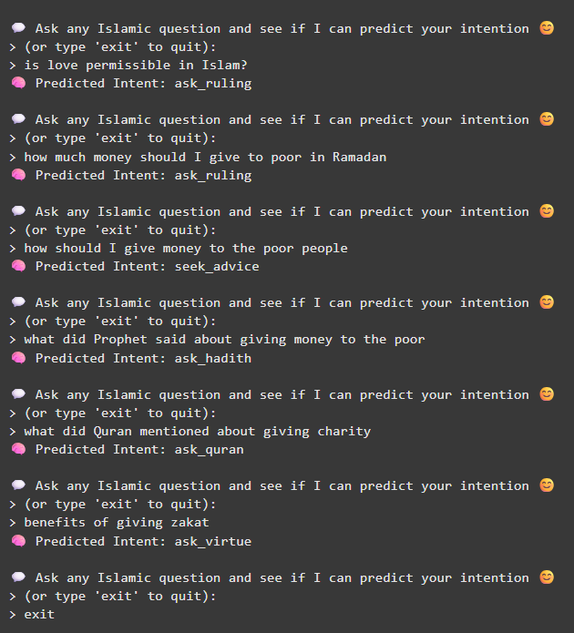
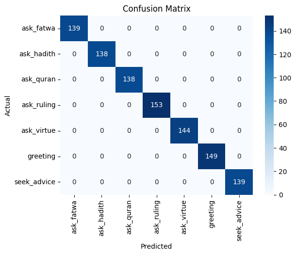

# Intent-Classifier

---

## 🚀 Getting Started

1. Open the notebook in Google Colab

  

2. Click Run All Button
3. And Ask any question to see if it can predict your intention!

---

## Result

Here is the Intent Prediction sample showing how different intentions of a similar subject are caught up successfully with this system: Subject was: `  Giving Money to the poor  `  

  

Here is the confusion matrix showing the model's performance based on `5000 dataset`:  

  

## 📚 What I Learned

- How to build an **intent classifier** for faith-oriented dialogue
- How to semantically embed user queries using transformers
- How to evaluate multiclass classifiers with confusion matrices
- Importance of understanding **what users want**, not just what they say

---

## 🧱 Next Step

This project becomes the **brain** of my chatbot:
- It detects the user's intent
- It triggers the Qur’an/Hadith retrieval, fatwa rulebase, or advice generator
- Can be integrated into LangChain or RAG pipeline later

---

## 🔬 My AI Research Roadmap

This is the third step in building an explainable, ethical AI system for Islamic knowledge applications:  

     
       

🧠 Project 3: You Are here  👁️  
🧩 Project 4: Build a rule-based + ML-based chatbot engine  
🤖 Project 5: Fine-tune LLMs on faith-aligned data (e.g., FaithDial)  

## 🤝 Author & Motivation
Built by Telot as part of a personal and academic journey to explore the intersection of:

📜 Faith-based knowledge  
🧠 Responsible AI  
🧪 Research in NLP and conversational agents  

This project is my first practical step toward a Muslim scholar chatbot that is rooted in verified sources and ethical design.

## 📬 Contact

Want to collaborate, mentor, or discuss faith-aware AI?
📧 Reach out at: heytelot@gmail.com
🌐 LinkedIn: 

🪪 License
This project is open source under the MIT License.
